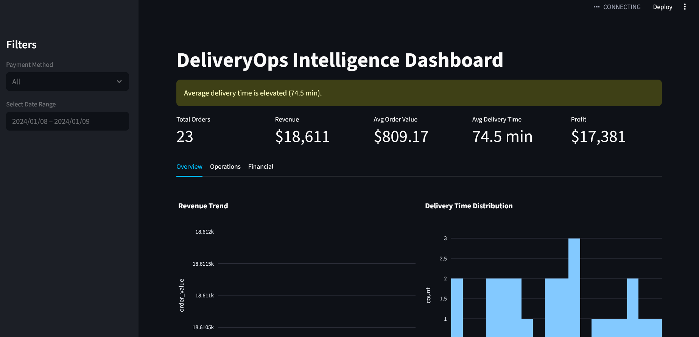

# Food Delivery Analytics Dashboard 🍔📊

Interactive data analytics dashboard for analyzing food delivery operations, customer behavior, and business performance.

---

## 📌 Project Overview

This project explores food delivery data to extract actionable business insights.  
It focuses on understanding order patterns, delivery performance, customer behavior, and revenue trends using Python and Streamlit.

---

## 🚀 Key Features

- 📦 Orders analysis (volume, trends, patterns)
- ⏰ Peak demand hours identification
- 🛵 Delivery time performance analysis
- 💰 Revenue and order value metrics
- 🧑 Customer behavior insights
- 📊 Interactive filters and visualizations

---

## 🛠️ Tech Stack

- Python
- Streamlit
- Pandas
- Plotly
- NumPy

---

## 🎯 Business Insights

This dashboard helps food delivery businesses to:

- Optimize delivery operations
- Identify peak demand periods
- Improve customer experience
- Understand revenue patterns
- Support data-driven decision making

---
## 📊 Business Dashboard Preview

Real-time analytics dashboard for food delivery operations.


---
## 🚀 Live Demo
https://fooddelivery-9tgh5uc7cr26ldqnyemxfx.streamlit.app/

## ▶️ How to Run Locally

```bash
pip install -r requirements.txt
streamlit run app.py
```

---

## 📈 Future Improvements

- Customer segmentation analysis
- Delivery partner performance metrics
- Predictive demand modeling
- Real-time data integration

---

## 📬 Contact

- LinkedIn: https://www.linkedin.com/in/veronica-bazterrica
- Email:  vbazterrica347@mail.com
